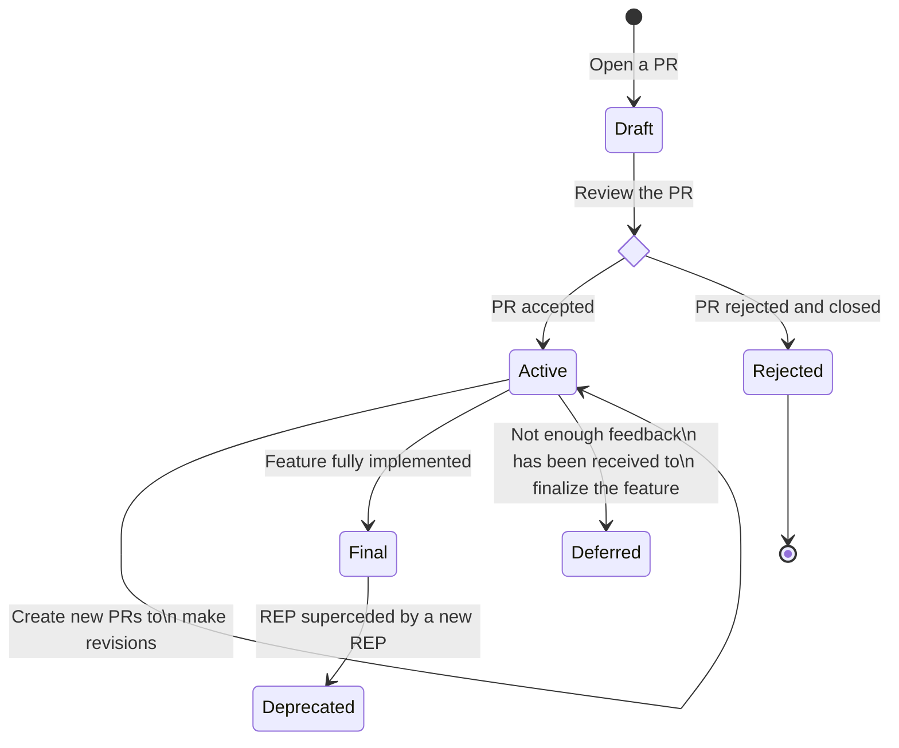

# Bicep REPs

A Bicep REP (Request for Enhancement Proposal) is a formal way to suggest significant changes to Bicep. It offers the Bicep team and the community an organized platform to share feedback, ensuring consensus on the project's direction.

## When to Follow the Process

Consider employing this process if you intend to make substantial changes to the Bicep programming language that would affect user experience. Example where the use of a REP is warranted include:
- *Introduction of New Features*: If the proposed change involves the addition of feature that has major user experience impact, particularly if it necessitates the use of a feature flag. Examples include, but are not limited to:
  - Adding a new syntax kind.
  - Adding a new ARM template function.
  - Adding a new Bicep CLI command.
  - Incorporating a Bicep VS Code extension feature that requires a new LSP protocol implementation.
- *Breaking Changes to Non-Experimental Features*: Any alterations that may potentially disrupt existing functionality of non-experimental features.
- *Feature Deprecation*: When contemplating the replacement of a feature that has already been shipped with a new feature.
- *Artitechtural changes*:  If the change is aimed at meeting internal non-functional requirements and involves a good amount of design work.

It's important to note that numerous other changes, such as bug fixes and minor feature enhancements, can be implemented through the regular issue triage and pull request review process within the primary Bicep repository.

## Who Should Create Bicep REPs

While members of the Bicep community are allowed to contribute by authoring new REPs and providing feedback, it's important to note that, in practice, Bicep REPs are typically submitted by the Bicep core maintainers. This submission follows an exclusive design and discussion process among the maintainers. The author of a Bicep REP is not only responsible for the initial design but also for implementing the proposed feature and overseeing the REP's lifecycle.

In many cases, a REP originates from a Bicep feature request issue that has garnered significant upvotes. Therefore, we encourage community members to contribute by initiating an issue for a feature proposal, actively participating in issue discussions, and expressing support through upvoting feature requests, rather than crafting REPs. This can prompt the Bicep core maintainers to initiate the creation of Bicep REPs.

## Bicep REPs Process

Bicep REPs progress through the following stages:

### Draft

This is the initial stage of a Bicep REP, signaling it as a work-in-progress. To create a draft REP, follow these steps:
- Copy `0000-rep-template.md` to `active/0000-my-proposed-feature` (replace `my-proposed-feature` with the actual feature name). Avoid assigning an REP number at this point.
- Complete the REP template.
    - Optionally, If the REP is an enhancement of an existing REP that does not introduce any breaking changes, the author should fill in the `Enhances` field to reference the REP that is being improved.
    - Optionally, if the REP deprecates an existing REP, the author should fill in the `Deprecates` field to reference the REP that is being deprecated.
- Submit a pull request. During the pull request phase, the REP will undergo design feedback from both Bicep core maintainers and the broader community. The author should be prepared to make revisions based on this feedback.
- Build consensus and integrate feedback.
- When the Bicep core maintainers feel confident about the design and have reached a consensus, they should proceed to vote on whether to accept or reject the REP.

> Note: The author has the option to submit a draft PR to initiate a REP before it is fully prepared for review. It's essential to clarify that a draft PR does not signify a draft REP state. A REP is in draft state only if the PR is ready for review.

### Active

Once a REP is reviewed and approved, it is considered active. The author should take the following steps to maintain the active state of the REP:
- Replace `0000` in the REP file name with the PR number.
- Merge the PR so that the REP file will appear in the active folder in the main branch.
- Proceed with the implementation of the proposed feature.
- Optionally, consider putting the feature behind a preview feature flag. This would give the author the opportunity to easily make revisions and breaking changes.
- As the author works towards a final implementation, submit PRs to the bicep-reps repository to keep the active REP in sync with the implementation.

### Final

REPs in the Final state are considered fully complete and stable without unresolved issues. The corresponding features must not be behind a feature flag. Any proposed changes must be made through a new REP which enhances or deprecates the final REP. To convert an active REP to a final, follow these steps:
- Ensure that the active REP is fully implemented and well tested, and there will be no breaking changes to the customer facing API contract.
- Submit a PR to move the REP from the active folder to the final folder.
    - Optionally, as part of the PR change, if the REP marked as final enhances an existing final REP, include in the existing REP a `Enhanced By` field to reference the new REP.

### Deferred

An active REP should be moved deferred if the feature does not receive enough positive user feedback. To do so, the author should send a PR to move the REP file from the active folder to the deferred folder.

### Deprecated

A final REP should marked as deprecated if a new REP improves it in a non-backward compatible way. Follow the steps below:
- When the new REP reaches the final state, as part of the PR change, move the old REP to the deprecated folder.
- Within the deprecated REP file, add a `Deprecated By` attribute and reference the new REP.

### Rejected

A rejected REP will lead to a closed PR. In practice, this occurrence should be rare.

### Bicep REP Lifecycle Visualization

Refer to the state diagram below for a visual representation of the Bicep REP lifecycle.

## Contributing

This project welcomes contributions and suggestions.  Most contributions require you to agree to a
Contributor License Agreement (CLA) declaring that you have the right to, and actually do, grant us
the rights to use your contribution. For details, visit https://cla.opensource.microsoft.com.

When you submit a pull request, a CLA bot will automatically determine whether you need to provide
a CLA and decorate the PR appropriately (e.g., status check, comment). Simply follow the instructions
provided by the bot. You will only need to do this once across all repos using our CLA.

This project has adopted the [Microsoft Open Source Code of Conduct](https://opensource.microsoft.com/codeofconduct/).
For more information see the [Code of Conduct FAQ](https://opensource.microsoft.com/codeofconduct/faq/) or
contact [opencode@microsoft.com](mailto:opencode@microsoft.com) with any additional questions or comments.

## Trademarks

This project may contain trademarks or logos for projects, products, or services. Authorized use of Microsoft 
trademarks or logos is subject to and must follow 
[Microsoft's Trademark & Brand Guidelines](https://www.microsoft.com/en-us/legal/intellectualproperty/trademarks/usage/general).
Use of Microsoft trademarks or logos in modified versions of this project must not cause confusion or imply Microsoft sponsorship.
Any use of third-party trademarks or logos are subject to those third-party's policies.

