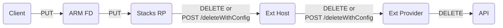
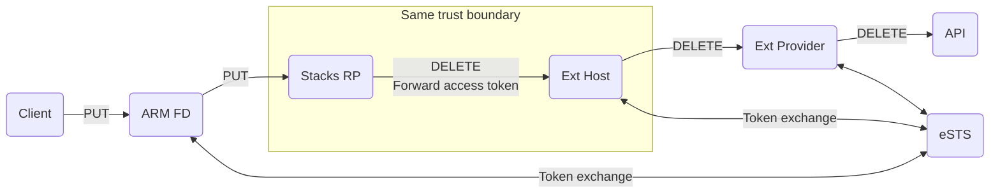
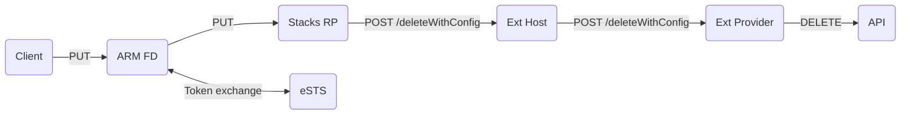

# Integrating extensible resources and deployment stacks

## Summary

The 0003 REP updates the deployments API to introducing addtional tracking information for extensible resources, which aims to equip users with detailed insights into the deployment processes of extensible resources. This REP further enriches the deployment APIs by offering comprehensive information on extensible resources and their corresponding providers, including details like extensible resource reference IDs and provider configurations. This improvement is designed to ensble support for Deployment Stacks, thereby facilitating the management of the extensible resource lifecycle, with a particular focus on enabling resource deletion through Deployment Stacks. The foundation of this REP is largely inspired by the concepts presented by @anthony-c-martin's [Stacks + Bicep Extensibility](https://gist.github.com/anthony-c-martin/9b7f8e8545c0848f3d8bfee234ba4360) gist.

## Terms and definitions

### Deployemnt Stacks

An Azure deployment stack is a type of Azure resource that enables the management of a group of Azure resources as an atomic unit. See the [documenation](https://learn.microsoft.com/en-us/azure/azure-resource-manager/bicep/deployment-stacks?tabs=azure-powershell) for details.

### OAuth 2.0 On-behalf-of (OAuth OBO) flow

The [Microsoft identity platform and OAuth 2.0 On-Behalf-Of flow](https://learn.microsoft.com/en-us/entra/identity-platform/v2-oauth2-on-behalf-of-flow), which describes the scenario of a web API using an identity other than its own to call another web API. Referred to as delegation in OAuth, the intent is to pass a user's identity and permissions through the request chain.

The flow is a non-standard OAuth 2.0 extension developed by Microsoft.

## Motivation

Deployment Stacks offer users the convenience of managing a set of resources as a unified entity, enabling quicker updates and deletions. Currently, this functionality is limited to Azure resources due to the absence of a unique identifier (resource ID) for extensible resources and a standardized authentication mechanism across different extensibility providers.

To overcome these limitations, the REP suggests modifications to the deployments API. A proposed change is the introduction of a `referenceID` field in `outputResources`, a freefrom string designed to uniquely identify extensible resources. Additionally, the proposal includes updates to the `deploymentProviders`, enabling it to store provider configurations. These configurations may include references to key vaults or resource properties, which can be utilized to access authentication details safely. These proposed enhancements allows Deployment Stacks to interact with extensibility providers to delete extensible resources.

Implementing these changes ensure that extensible resources can be managed with the same level of efficiency and security as Azure resources within Deployment Stacks.

## Detailed design

### Reference ID

> A reference ID is a URL-encoded, free-form string designed to uniquely identify an extensible resource. This ID is generated by extensibility providers and is returned as part of the responses from the `POST /resources/reference` or `POST /resources/preview` extensible resource APIs. The concept and design of reference IDs have been finalized.
>
> Any reference ID MUST adhere to the format `{flags}-{uniqueId}`.

> - `{flags}`: This section consists of two binary digits indicating the type of reference ID. The currently accepted values are `00` and `01`:
>   - `00`: signifies that the reference ID is autonomous and doesn't need extra data for GET and DELETE actions. This implies the utilization of the extensible resource APIs `GET /resources/{referenceId}` and `DELETE /resources/{referenceId}` for operations.
>   - `01`: indicates that additional information, specifically user-provided provider configuration (like a connection string), is essential alongside the reference ID to execute GET and DELETE operations. In this case, APIs `POST /resources/{referenceId}/getWithConfig` and `POST /resources/{referenceId}/deleteWithConfig` must be used, and the provider configuration must be included in the request body.
> - `{uniqueId}`: This is a URL-encoded free-form string that serves to uniquely identify a resource. The format of uniqueId is defined by the providers and is opaque to the Azure Deployments engine.
>
> For more information about reference IDs and the related extensible resource APIs, refer to the [Extensibility Provider API V2 OpenAPI spec](https://github.com/Azure/bicep-extensibility/blob/6e9bb144e25edec683f226aedcbbae6b5e57f293/docs/vnext/openapi.yaml#L28). For a more user-friendly and navigable reading experience, the specification is also viewable through [ReDoc](https://redocly.github.io/redoc/?url=https://raw.githubusercontent.com/Azure/bicep-extensibility/main/docs/vnext/openapi.yaml&nocors).

To provide Deployemnt Stacks resource identifiable information, `referenceId` is added to the `outputResources` property of a successful deployment:

```diff
{
  ...
  "type": "Microsoft.Resources/deployments",
  "properties": {
    "outputResources": [
      // Azure resource
      {
        "id": "/subscriptions/00000000-0000-0000-0000-000000000001/resourceGroups/my-resource-group/providers/Microsoft.Storage/storageAccounts/my-storage-account"
      },
      // Extensible resource
      {
        "symbolicName": "myService",
        "resourceType": "core/Service@v1",
        "deploymentProvider": "kubernetes",
+       "referenceId": "01-core%3Av1%3Aservices%3AService%3Adefault%3AmyService%3Abb170201ef5d8f4449fd06812f53dc3d970875ca2c25abbe2bfc3683db807a81"
      }
    ]
  }
}
```

> See [K8sResourceReferenceId](https://github.com/Azure/bicep-extensibility/blob/6e9bb144e25edec683f226aedcbbae6b5e57f293/src/Azure.Deployments.Extensibility.Providers.Kubernetes/V2/Models/K8sResourceReferenceId.cs#L17) for details about the K8s resource reference ID format in the example above.

For deleting an extensible resource, Deployment Stacks utilize the `referenceId` as a URL path parameter to call the delete APIs (`DELETE /resources/{referenceId}` or `POST /resources/{referenceId}/deleteWithConfig` depending on the reference ID flags) of the extensible resource. When the deletion request is received, the extensibility provider decodes the `referenceId` to precisely identify the target resource and execute the deletion process.

### Authentication & authorization

The resource deletion process orchestrated by Deployment Stacks involves several key components: the client (such as Azure CLI), ARM Frontdoor, the Deployment Stacks RP, the extensibility host, and the extensibility provider, and the underlying API the extensibility provider invokes.

The resource deletion workflow managed by Deployment Stacks includes a sequence of interactions between the client (like Azure CLI), ARM Frontdoor (FD), Deployment Stacks resource provider, the extensibility host, the extensibility provider, and the API that the extensibility provider calls. The process starts with the client issuing a PUT request to ARM FD, which then forwards it to the Stacks RP. The Stacks RP subsequently sends a `DELETE /resources/{referenceId}` or a `POST /resources/{referenceId}/deleteWithConfig` to the extensibility host. The extensibility host, in turn, sends a similar request to the extensibility provider, which finally issues a DELETE request to the underlying API.

Here's a diagram illustrating this flow:



This process is safeguarded by various authentication and authorization mechanisms to ensure the security of the deletion operation.

#### Service to service (S2S) authentication

S2S authentication is currently mandated from ARM Frontdoor to the Deployment Stacks RP, as part of the RP onboarding protocol, through the use of Proof of Possession (PoP) tokens. However, a comparable authentication framework has not been set up between the Stacks RP and the extensibility host, nor between the extensibility host and the extensibility providers. While the implementation of a similar mechanism in these areas might be necessary for enhanced security, the development of such a system is beyond the scope of this REP.

#### Authorization through OAuth OBO for extensibility providers and APIs supported by 1P apps

For extensibility providers and APIs backed by first-party applications, like the MS Graph provider and API, the OAuth OBO flow is utilized to ensure a fluid authorization process from the client to the ultimate API. This approach securely delegates user credentials, enabling the upstream service to interact with the downstream API on the user’s behalf, thereby guaranteeing a consistent and secure authentication experience. Given that such providers typically do not require extra authentication and authorization details through provider configuration, the flags of reference ID they return should invariably be `00`. Consequently, Deployment Stacks should consistently employ `DELETE /resources/{referenceId}` for deletion operations. See the following diagram for a high-level visualization of the process:



The detailed implementation of OAuth OBO, however, involves complex design considerations that are outside the scope of this REP document and can be addressed by the Stacks team in a dedicated design discussion.

#### Authentication and authorization through provider configuration

For extensibility providers and APIs outside the realm of first-party applications, the authentication and authorization context must be supplied by the user. This can be done by specifying provider configuration in the Bicep file, ARM template, or at deploy-time through command line arguments (requires further discussion, a rough design is outlined in [Bicep Provider Import Proposal](https://gist.github.com/shenglol/272aa2027d9f0c5fb1882d5189c1164a)). This setup enables the provider to use these credentials to call the API. An example of this scenario is the Kubernetes provider, which requires a base64-encoded kubeConfig string to establish a connection with the Kubernetes cluster control plane, an external system. In these cases, the reference ID flags should be set to `01`, signifying that provider configuration is necessary for performing resource deletions. Consequently, Deployment Stacks must utilize the `POST /resources/{referenceId}/deleteWithConfig` API for deletion operations.

It's important to note that the OAuth On-Behalf-Of (OBO) flow should still be employed for the communication from ARM Frontdoor (FD) to Stacks Resource Provider (RP), as ARM FD does not have visibility into the reference ID and therefore cannot conditionally select an authentication flow based on it. The following diagram illustrates this process:



Given that the API mandates the inclusion of provider configuration within the request body, it's essential that this configuration be preserved within the `deploymentProviders` section of a deployment once it has been successfully completed. This will be further discussed in the subsequent section.

### Preseving provider configuration

> For reference, [Bicep Provider Import Proposal](https://gist.github.com/shenglol/272aa2027d9f0c5fb1882d5189c1164a) outlines the method for providing provider configurations. In this proposal, each provider configuration item is marked with a basic ARM template parameter type, including int, string, bool, array, object, secureString, and secureObject. The proposal is partially implemented in the Deployments repo, but it remains under an experimental language version that has not been released to the public.

As mentioned in the [Authentication and authorization through provider configuration](#authentication-and-authorization-through-provider-configuration) section, the deployments API must be updated to save provider configuration to support the invocation of the `POST /resources/{referenceId}/deleteWithConfig` API.

For example, below is an ARM template with the Kubernetes provider imported:

```JSON
{
  "$schema": "https://schema.management.azure.com/schemas/2019-04-01/deploymentTemplate.json#",
  "contentVersion": "1.0.0.0",
  "providers": {
    "k8s": {
      "name": "Kubernetes",
      "version": "1.0.0",
      "config": {
        "kubeConfig": {
          "type": "secureString"
        },
        "context": {
          "type": "string",
          "nullable": true
        },
        "namespace": {
          "type": "string",
          "nullable": true
        }
      }
    }
  },
  "parameters": {},
  "resources": {}
}
```

At deployment time, the customer supplies values for the configuration items. This can be done by explicity setting the values, supplying a Key Vault secret reference, or through a runtime value access, such as listing secret of a resource. Depending on the configuration item types and how their values are specified, the storage of configuration values post-deployment varies. For security reasons, there are instances where these values are not stored, leading Deployment Stacks to relinquish management of the resources.

#### Explicit value, non-secure type

Configuration values that are explicitly provided and are of a non-secure type can be safely stored for future reference by Deployment Stacks.

- Deployment PUT request:

```JSON
{
  ...
  "type": "Microsoft.Resources/deployments",
  "properties": {
    ...
    "deploymentProviderConfigurations": {
      "k8s": {
        "namespace": {
          "value": "myNamespace"
        }
      }
    }
  }
}
```

- Deployment GET response:

```diff
{
  ...
  "type": "Microsoft.Resources/deployments",
  "properties": {
    ...
    "deploymentProviders": [ // TODO: final property name TBD. Update once 0003 is merged.
      {
        "alias": "k8s",
        "name": "Kubernetes",
        "version": "1.27.8",
        "deploymentId": "/subscriptions/00000000-0000-0000-0000-000000000001/resourceGroups/my-resource-group/providers/Microsoft.Resources/deployments/my-deployment",
+       "config": {
+         "namespace": {
+           "value": "myNamespace"
+         }
+       }
      }
    ]
  }
}
```

#### Explicit value, non-secure type

When a configuration item is marked as a `secureString` or `secureObject` and its value is specified directly, the entire provider configuration object should be excluded from the output once the deployment successfully completes. This precaution is taken to ensure the security and confidentiality of sensitive information, preventing it from being exposed in deployment outputs.

- Deployment PUT request:

```JSON
{
  ...
  "type": "Microsoft.Resources/deployments",
  "properties": {
    ...
    "deploymentProviderConfigs": {
      "k8s": {
        "kubeConfig": {
          "value": "TOP_SECRET"
        },
        "namespace": {
          "value": "myNamespace"
        }
      }
    }
  }
}
```

- Deployment GET response:

```JSON
{
  ...
  "type": "Microsoft.Resources/deployments",
  "properties": {
    ...
    "deploymentProviders": [
      {
        "alias": "k8s",
        "name": "Kubernetes",
        "version": "1.27.8",
        "deploymentId": "/subscriptions/00000000-0000-0000-0000-000000000001/resourceGroups/my-resource-group/providers/Microsoft.Resources/deployments/my-deployment",
      }
    ]
  }
}
```

Deployment Stacks should be able to identify that they cannot delete resources provisioned by the k8s provider in this case. This is indicated by a reference ID beginning with `01`. This flag signifies that provider configuration is required for resource deletion. However, since such configuration is unavailable within the deployment entity, Deployment Stacks cannot proceed with resource deletion.

#### Configuration value supplied with Key Vault secret reference

When a configuration item uses a Key Vault secret reference, the provider configuration object can be preserved. For deleting a resource, Deployment Stacks can safely obtain the configuration by dereferencing the secret.

- Deployment PUT request:

```JSON
{
  ...
  "type": "Microsoft.Resources/deployments",
  "properties": {
    ...
    "deploymentProviderConfigs": {
      "k8s": {
        "kubeConfig": {
          "reference": {
            "keyVault": {
              "id": "/subscriptions/00000000-0000-0000-0000-000000000001/resourceGroups/my-resource-group/providers/Microsoft.KeyVault/vaults/my-vault"
            },
          "secretName": "kubeConfig"
        }
        },
        "namespace": {
          "value": "myNamespace"
        }
      }
    }
  }
}
```

- Deployment GET response:

```diff
{
  ...
  "type": "Microsoft.Resources/deployments",
  "properties": {
    ...
    "deploymentProviders": [ // TODO: final property name TBD. Update once 0003 is merged.
      {
        "alias": "k8s",
        "name": "Kubernetes",
        "version": "1.27.8",
        "deploymentId": "/subscriptions/00000000-0000-0000-0000-000000000001/resourceGroups/my-resource-group/providers/Microsoft.Resources/deployments/my-deployment",
+       "config": {
+         "kubeConfig": {
+           "reference": {
+             "keyVault": {
+               "id": "/subscriptions/00000000-0000-0000-0000-000000000001/resourceGroups/my-resource-group/providers/Microsoft.KeyVault/vaults/my-vault"
+             },
+             "secretName": "kubeConfig"
+           }
+         },
+         "namespace": {
+           "value": "myNamespace"
+         }
+       }
+     }
    ]
  }
}
```

#### Configuration value supplied through runtime reference

When configuring a nested deployment, it's possible to use runtime references for configuration values. Consider the example of a Bicep module that sets up a Kubernetes deployment with configuration derived from an AKS cluster's admin credentials:

```Bicep
resource aksCluster 'Microsoft.ContainerService/managedClusters@2020-09-01' = {
  ...
  name: 'aksCluster'
}

module k8sDeployment 'k8s.bicep' = {
  name: 'k8sDeployment'
  providerConfigs: {
    kubeConfig: aksCluster.listClusterAdminCredential().kubeconfigs[0].value
  }
}
```

In the ARM template generated from this Bicep module, a nested deployment is created, including the kubeConfig as a runtime reference:

```JSON
{
  "k8sDeployment": {
    "name": "k8sDeployment",
    "type": "Microsoft.Resources/deployments",
    "properties": {
      "deploymentProviderConfigs": {
        "k8s": {
          "kubeConfig": {
            "value": "[listClusterAdminCredential(resourceId('Microsoft.ContainerService/managedClusters', 'aksCluster'), '2020-09-01').kubeconfigs[0].value]"
          },
          "namespace": {
            "value": "myNamespace"
          }
        }
      }
    }
  }
}
```

During the deployment process, the system recognizes kubeConfig as a runtime reference and can store metadata about this reference within the deployment entity. After the deployment is successful, this metadata is incorporated into the deploymentProviders section:

```diff
{
  ...
  "type": "Microsoft.Resources/deployments",
  "properties": {
    ...
    "deploymentProviders": [ // TODO: final property name TBD. Update once 0003 is merged.
      {
        "alias": "k8s",
        "name": "Kubernetes",
        "version": "1.27.8",
        "deploymentId": "/subscriptions/00000000-0000-0000-0000-000000000001/resourceGroups/my-resource-group/providers/Microsoft.Resources/deployments/my-deployment",
+       "config": {
+         "kubeConfig": {
+           "runtimeReference": {
+             "resourceId": "/subscriptions/00000000-0000-0000-0000-000000000001/resourceGroups/my-resource-group/providers/Microsoft.ContainerService/managedClusters/aksCluster",
+             "action": "listClusterAdminCredential", // Possible values include "reference" and "list*" actions.
+             "propertyPath": "$.kuberconfig[0].value" // A JSONPath query to the accessed property.
+           }
+         },
+         "namespace": {
+           "value": "myNamespace"
+         }
+       }
+     }
    ]
  }
}
```

The addition of runtime reference metadata is essential for security and operational efficiency. Without it, the `kubeConfig` configuration item would be a direct value which will be omitted from the deployment GET response for security, preventing Deployment Stacks from managing Kubernetes resource deletions. Another benefit of this metadata is that it creates an implicit dependency on referenced resources, which can potentially simplify the resource deletion process. If Deployment Stacks manage and delete a referenced resource beforehand, it might eliminate the need for a separate deletion of the dependent resource, as the runtime value cannot be restored. Moreover, the dependent resource might no longer exist; for instance, if the AKS cluster is removed, any Kubernetes resources within it would no longer exist.

## Drawbacks

### High Implementation Costs

Implementing the changes outlined in the REP could be a time-intensive process, demanding substantial resource allocation from the Stacks team. Strategic planning is essential to ensure that the deployment of these changes is both efficient and aligned with broader organizational goals.

## Alternatives

### Delicated `auth` property in provider config

As initially proposed in Anthony's [gist](https://gist.github.com/anthony-c-martin/9b7f8e8545c0848f3d8bfee234ba4360#part-1-authentication), introducing a dedicated `auth` property for storing authentication-related provider configurations could be an alternative to leveraging configuration value types for managing the persistence of provider configurations. This auth property, structured as an object, would include a mandatory `type` field serving as a discriminator to validate different available authentication mechanisms. These mechanisms could range from `UserProvided`, where users directly input credentials, to `KeyVaultSecret`, where credentials are securely stored and accessed from Azure Key Vault, and potentially `ResourceReference` for configurations provided by runtime resource references.

> The concept of `ResourceReference` is mentioned but not elaborated upon in the gist, hence no examples are provided to illustrate its application or structure.

Bicpe examples:

```diff
// UserProvided
module k8sDeployment 'k8s.bicep' = {
  name: 'k8sDeployment'
  providerConfigs: {
-   kubeConfig: 'TOP SECRET'
+   auth: {
+     type: 'UserProvided'
+     value: 'TOP SECRET'
+   }
    namespace: 'myNamespace'
  }
}

// KeyVaultSecret
module k8sDeployment 'k8s.bicep' = {
  name: 'k8sDeployment'
  providerConfigs: {
-   kubeConfig: kv.getSecret('myKubeConfig')
+   auth: {
+     type: 'KeyVaultSecret'
+     keyVaultId: kv.id
+     secretName: 'myKubeConfig'
+   }
    namespace: 'myNamespace'
  }
}
```

Deployment output examples:

```diff
{
  ...
  "type": "Microsoft.Resources/deployments",
  "properties": {
    ...
    "deploymentProviders": [ // TODO: final property name TBD. Update once 0003 is merged.
      {
        "alias": "k8s",
        "name": "Kubernetes",
        "version": "1.27.8",
        "deploymentId": "/subscriptions/00000000-0000-0000-0000-000000000001/resourceGroups/my-resource-group/providers/Microsoft.Resources/deployments/my-deployment",
        "config": {
-         "kubeConfig": {
-           "reference": {
-             "keyVault": {
-               "id": "/subscriptions/00000000-0000-0000-0000-000000000001/resourceGroups/my-resource-group/providers/Microsoft.KeyVault/vaults/my-vault"
-             },
-             "secretName": "kubeConfig"
-           }
-         },
+         "auth": {
+           "type": "UserProvided",
+         },
          "namespace": {
            "value": "myNamespace"
          }
        }
      }
    ]
  }
}
```

```diff
{
  ...
  "type": "Microsoft.Resources/deployments",
  "properties": {
    ...
    "deploymentProviders": [ // TODO: final property name TBD. Update once 0003 is merged.
      {
        "alias": "k8s",
        "name": "Kubernetes",
        "version": "1.27.8",
        "deploymentId": "/subscriptions/00000000-0000-0000-0000-000000000001/resourceGroups/my-resource-group/providers/Microsoft.Resources/deployments/my-deployment",
        "config": {
-         "kubeConfig": {
-           "reference": {
-             "keyVault": {
-               "id": "/subscriptions/00000000-0000-0000-0000-000000000001/resourceGroups/my-resource-group/providers/Microsoft.KeyVault/vaults/my-vault"
-             },
-             "secretName": "kubeConfig"
-           }
-         },
+         "auth": {
+           "type": "KeyVaultSecret",
+           "keyVaultId": "/subscriptions/00000000-0000-0000-0000-000000000001/resourceGroups/my-resource-group/providers/Microsoft.KeyVault/vaults/my-vault"
+           "secretName": "myKubeConfig",
+         },
          "namespace": {
            "value": "myNamespace"
          }
        }
      }
    ]
  }
}
```

Adopting the auth property approach can potentially simplify the implementation process by utilizing a static discriminator. This method reduces the need for extensive dynamic analysis of provider configuration values during deployment, streamlining the process of saving their metadata to the deployment entity. On the other hand, However, this model has its challenges. Users are required to explicitly set the discriminator each time they supply provider configuration if `auth` is required, adding an extra step. Moreover, the term `auth` might not be as descriptive or accurate compared to more specific names like `kubeConfig`, especially in contexts where the authentication details pertain to specific services or purposes. This could lead to some ambiguity or confusion regarding the nature of the configurations being provided.

## Rollout plan

As the changes are drastic, the feature may likely require an ARM feature flag. It is up to the Stacks team to figure out the concrete rollout plan.

## Unresolved questions

- Discuss the pros and cons of the provider configuration schema proposed by this REP and the alternative.

## Out of scope

### Detailed design for OAuth OBO integration

Crafting the intricate blueprint for incorporating the OAuth OBO flow within Deployment Stacks is beyond the scope of the REP.

### Resource rocking

Deployment Stacks enables the locking of ARM resources to protect them from external changes or deletions. This functionality, however, doesn't extend to all control planes due to their diverse architectures and capabilities. Future revisions of the extensibility contract might explore the addition of resource locking, especially if there's significant demand or compatibility with a specific control plane's features. For the time being, expanding this feature beyond ARM resources remains outside the current scope.
